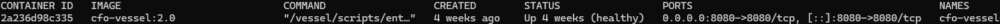
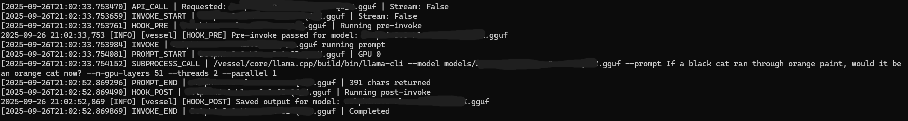
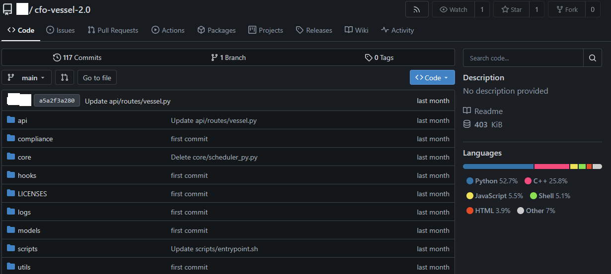

  # CFO Vessel (Demo)

  A **public-safe demo** of the Vessel engine. In the full system, Vessel is the
  model runtime that launches/loads local models, manages GPU/CPU memory, and exposes
  a clean inference API. This demo returns a **canned response** and includes no model binaries.

  ---

  ## Quick Start

  ### Run with Docker
  ```bash
  docker build -t cfo-vessel-demo .
  docker run --rm -p 8000:8000 cfo-vessel-demo
  ```

  ### Or run locally (no Docker)
  ```bash
  python -m venv .venv && source .venv/bin/activate
  pip install -r requirements.txt
  uvicorn src.main:app --host 0.0.0.0 --port 8000
  ```

  ### Test
  ```bash
  curl -s -X POST http://localhost:8000/api/infer \
-H "Content-Type: application/json" \
-d '{"prompt":"Hello Vessel"}'
  ```

  ---

  ## API

  - `GET /api/healthz` -> `{"status":"ok"}`
  - `POST /api/infer` -> `{"output":"(demo) Generated response for: ...", "meta": {...}}`

  ---

  ## Sequence

  ```mermaid
  sequenceDiagram
    participant R as "CFO Router (Demo)"
    participant V as "CFO Vessel (Demo)"
    R->>V: POST /api/infer {"prompt": "Hello Vessel"}
    V-->>R: 200 {"output": "(demo) Generated response for: Hello Vessel"}
  ```

  **Explanation:** Router calls Vessel for generation. Demo returns a canned response. No models are loaded.

  ---

  ## Demo Screenshots

  Screenshots from a local test environment (sensitive details redacted):

  - **Docker container running**  
    

  - **Vessel infer call**  
    

  ---

  ## Private Gitea Screenshot

  Screenshot from local private Gitea repo (sensitive details redacted):

  * **cfo-vessel repo**

  
  
  ---

  ## Disclaimer
  See [DISCLAIMER.md](./DISCLAIMER.md). This is a demo-only repository.
  Full production implementations remain private.

  ## Security
  See [SECURITY.md](./SECURITY.md). Do not expose demo services to the internet.

  ## License
  All Rights Reserved. See [LICENSE.md](./LICENSE.md).
